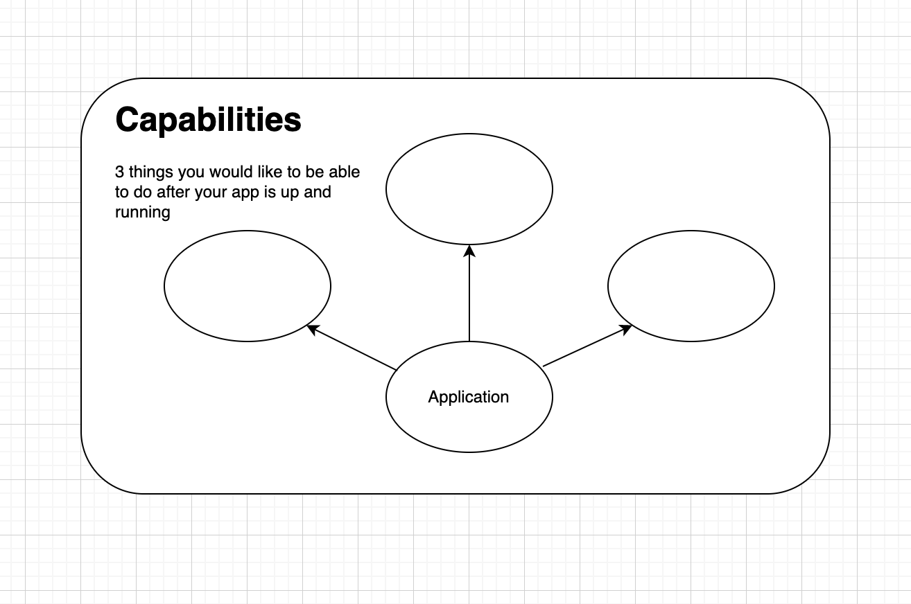

# Quick Exercise

## What I would like to be able to do after my app is up and running?

Think about the application you want to make available to your users and
write down 3 things that you want to be able to do **relatively quickly and easily**
after you do into production.

Draw them out on paper using a template similar to the one below:

Once you've done this we can have a quick round-the-table where everyone shares their
responses.

Questions about why someone chose a particular topic are completely welcome - be chatty.

[Click here to continue](../kubernetes-architecture.md)
