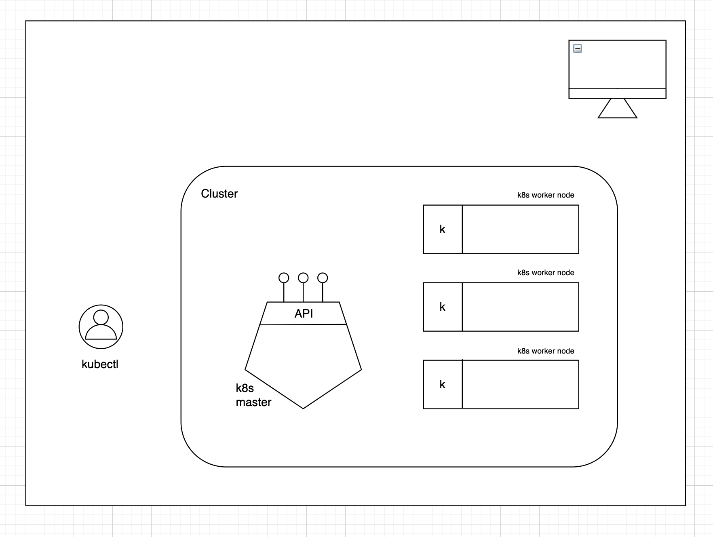

# Kubernetes Architecture

Let's now take a very simplified look at the Kubernetes architecture from a users
point of view.

## General Overview

The following diagram shows a cluster setup where we have one Master and 3 worker
nodes (where our deployment will end up).

For now, these nodes can be in the same location, but they can even be in different
locations and this would be ok.

## The Master

As you can see, there is a pentagram shaped object that is defined as the Kubernetes Master.
This is a very import part of the cluster and has a lot of components in it. Today, we are going
to focus on one aspect - the `API server` that it runs.

## The API Server

The API server is what allows us to run all of our workloads. It exposes a set of capabilities
that allow us to define exactly how we want to run workloads.

## Worker nodes

On the right, we have the worker nodes of the cluster. This is where our workloads will be
scheduled and run.

## The Kubelet

The most important process running on the worker nodes for us right now is the `kubelet`.
This process is responsible for scheduling and making sure our workloads are healthy and
running on the worker nodes.

## Kubectl

The Master and the kubelets will work together a lot because we will be sending requests
via the `kubectl` command line tool to the API server that will then send these on to the
worker nodes.

## YAML

Kubernetes uses YAML to describe the resources that are sent to the API server which create
the application on the worker nodes.

## Hands on training

So, now we'll get into doing some actual work with what we've learned using the `kubectl`
command line tool.

[Click here to continue](./exercises/lab-setup.md)
