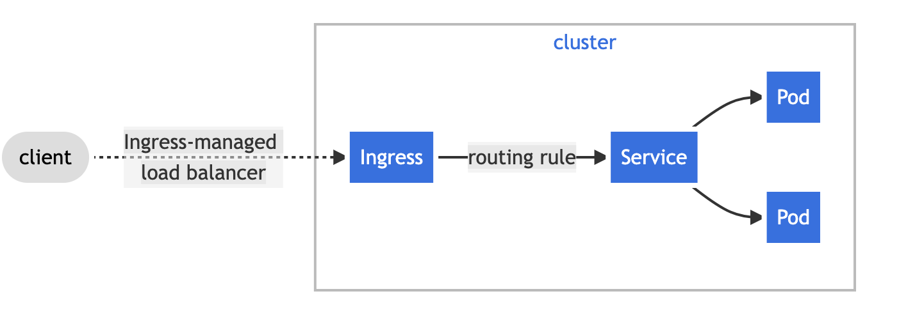

# What is an Ingress?

An Ingress is used to configure external access to the services in a
cluster, typically HTTP.

Ingresses also require an Ingress controller installed on the cluster.

## How it works

An Ingress exposes HTTP and HTTPS routes from outside the cluster to services
within the cluster. Traffic routing is controlled by rules defined on the Ingress
resource.



Below is a sample yaml file defining an ingress.

```yaml
apiVersion: networking.k8s.io/v1
kind: Ingress
metadata:
  name: frontend-ingress
  annotations:
    nginx.ingress.kubernetes.io/rewrite-target: /$1
spec:
  rules:
  - host: frontend.demo
    http:
      paths:
      - path: /
        pathType: Prefix
        backend:
          service:
            name: frontend
            port:
              number: 80
```

In order for this to work you would have to get the IP address of the ingress and add it to
your local `/etc/hosts` file.

Do this by running

```bash
kubectl get ingress
```

And you will be given a result like

```bash
NAME              CLASS    HOSTS              ADDRESS        PORTS   AGE
frontend-ingress  <none>   frontend.demo      172.17.0.15    80      63s

### Official Documentation

[Kubernetes Ingress](https://kubernetes.io/docs/concepts/services-networking/ingress/)
[Kubernetes Ingress Controllers](https://kubernetes.io/docs/concepts/services-networking/ingress-controllers/)
